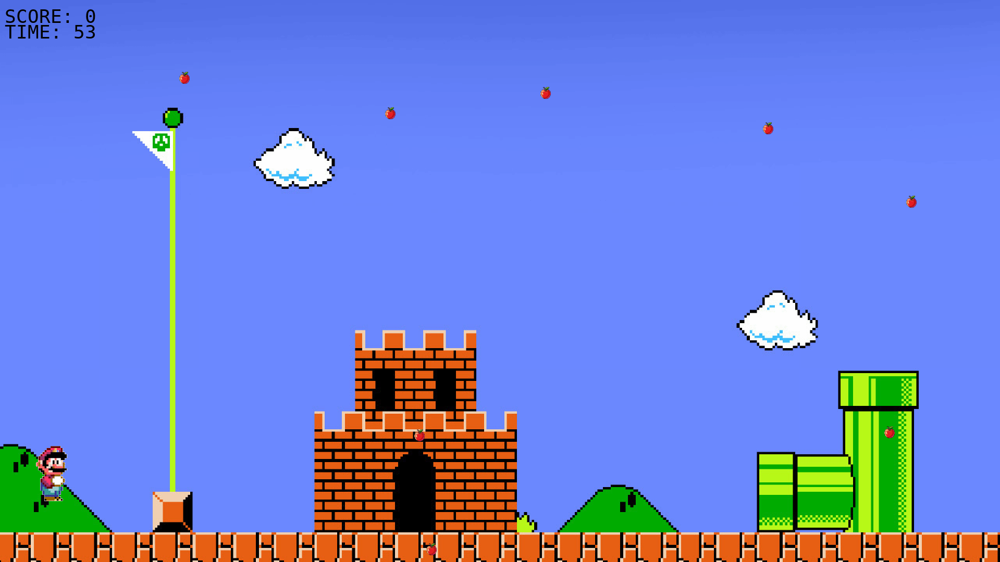

# FUNZIONAMENTO

Piccolo videogioco di SuperMario basato su PYGAME

Mario si puo muovere con le frecce direzionali per poter mangiare le mele.

Salta con freccia su.

Ogni volta che mangia una mela aumenta il punteggio.

Il gioco termina dopo 60 secondi.

